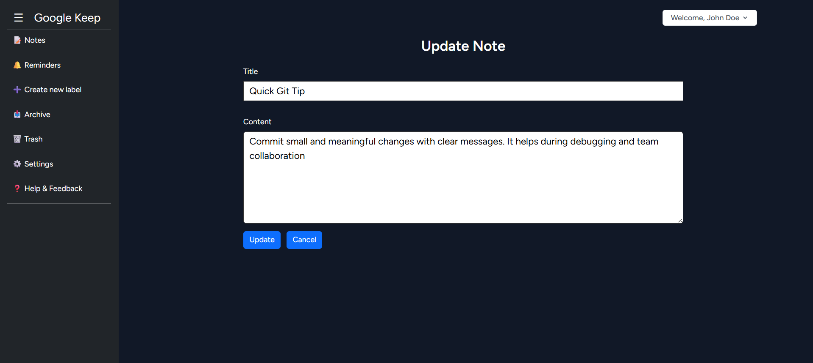

# 📋 Google Keep Clone 📝

A simple note-taking web application inspired by [Google Keep](https://keep.google.com/), built with **Laravel**, **MySQL**, and **Tailwind CSS**.  
Users can create, edit, view, and delete personal notes securely with authentication.

---

## 🚀 Features

- ✅ User Authentication (Laravel Breeze)
- ✅ Create, Read, Update, Delete Notes
- ✅ Notes visible only to the logged-in user
- ✅ Form validation & error handling
- ✅ Flash messages for actions (success, error)
- ✅ Responsive design with Bootstrap or Tailwind

---

## 🛠 Tech Stack

- **Backend**: Laravel 10+
- **Frontend**: Blade, Tailwind CSS / Bootstrap
- **Auth**: Laravel Breeze
- **Database**: MySQL
- **Other**: Laravel Policies for Authorization, Vite

---

## 📦 Installation

1. **Clone the repository**

```bash
git clone https://github.com/ganeshkannanpm/Google-Keep-Clone.git
cd google-keep-clone
```

2. **Install dependencies**

```bash
composer install
npm install
```

3. **Environment setup**

```bash
cp .env.example .env
php artisan key:generate
```

4. **Database setup**

- Create a MySQL database
- Update `.env` with your DB credentials:

```env
DB_DATABASE=your_db_name
DB_USERNAME=your_db_user
DB_PASSWORD=your_db_password
```

5. **Run migrations**

```bash
php artisan migrate
```

6. **Compile frontend assets**

```bash
npm run dev
```

7. **Serve the app**

```bash
php artisan serve
```

Visit: [http://localhost:8000](http://localhost:8000)

---

## 🔐 Authentication

- Register a new user
- Each user can only see/edit/delete their own notes
- Authorization handled using Laravel policies

---

## 📸 Screenshots *(Optional)*

Include a few screenshots here:

```markdown



```

---

## 📁 Folder Structure

| Folder | Purpose |
|--------|---------|
| `app/Models/Note.php` | Note model |
| `app/Http/Controllers/NoteController.php` | Note logic |
| `resources/views/notes/` | Blade templates |
| `routes/web.php` | Routes setup |

---

## 🤝 Contributing

Contributions, suggestions, or improvements are welcome!

---

## 📝 License

This project is open-source and available under the [MIT License](LICENSE).
